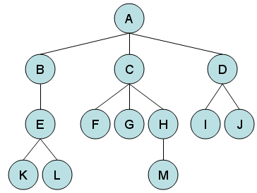

# Print a Tree Breadth-First

[Out of date slides](http://slides.com/benjaminconant/reacto#/)

[1610 FSGHA NY slides](https://docs.google.com/presentation/d/1OlUuRagt3OFt6LW5XcpYVtmGpW_MHBmfAffpPwj4MMg/edit?usp=sharing)

[161 FSGHA 0NY repl](https://repl.it/FOsY/1)

*Difficulty: Medium*

---

Today you will write a series of iterator functions for trees (as time allows):
* `breadthFirst`
* `depthFirstPreOrder`
* `depthFirstPostOrder`

A tree is represented by its root node, which is what your function will receive.

You can assume that each node in the tree contains the following properties:
* `.value` — the content (data) of the node, what you should print out
* `.children` — an ordered array of child nodes for that node

For the following examples consider this tree:


[source](https://www.cpp.edu/~ftang/courses/CS241/notes/images/trees/tree1.bmp)

Assume the tree is created with the following constructor:

```js
function Node(value) {
    this.value = value;
    this.children = [];
}
```

Populated like so:

```js
const a = new Node('a');
const b = new Node('b');
const c = new Node('c');
const d = new Node('d');
// etc.

a.children.push(b,c,d);
// etc.
```

One node of that tree might look like this:

```js
{
	value: 'a',
	children: [
	{ value: 'b', children: [Object] },
	     		{ value: 'c', children: [Object] },
	     		{ value: 'd', children: [Object] }
	]
}
```

Traversing over the tree with each function would produce the following results:

| Algorithm             | Order                       | Explanation                                                |
|-----------------------|-----------------------------|------------------------------------------------------------|
| `breadthFirst`        | `A B C D E F G H I J K L M` | Each "level" of the tree is printed in order               |
| `depthFirstPreOrder`  | `A B E K L C F G H M D I J` | Children nodes are visited before sibling nodes            |
| `depthFirstPostOrder` | `K L E B M F G H C I J D A` | A node is not traversed until all its children are reached |
